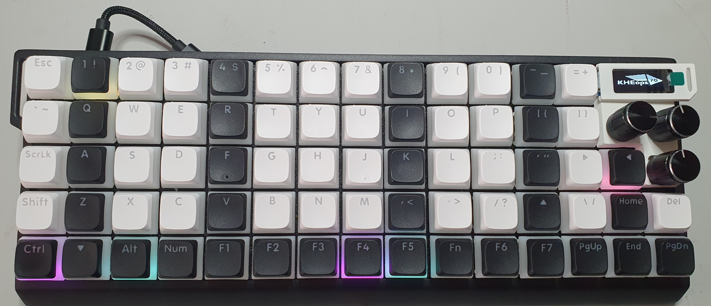
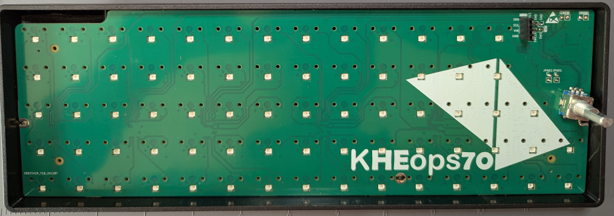
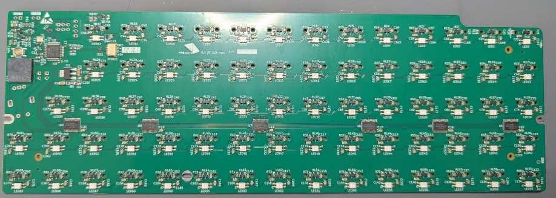

# KHEops70 
Keyboard | Hall Effect | OrthoLinear | Programmable | Standard-sized

| WARNING: DIY project. Use at your own risk!

| Forked from the [Moonboard Keyboard](https://github.com/certainly1182/MoonBoard).

&nbsp;&nbsp;&nbsp;&nbsp;&nbsp;&nbsp;&nbsp;&nbsp;

## Features

- 70 HE switches, 60% case, 13x5 + 5 keys + 1 encoder + 2 potentiometers in ortholinear arrangement.
- All keys are 1u. Keycaps in uniform profile preferred (XDA, DSA...).
- QMK Firmware compatibility.
- QMK MIDI Support (Audio support buggy).
- Compatibility with "standard" widely available 60% keyboard cases.
- OLED display.

## Hardware

Design for PCBs can be found in the hardware folder.

&nbsp;&nbsp;&nbsp;&nbsp;&nbsp;&nbsp;&nbsp;&nbsp;

&nbsp;&nbsp;&nbsp;&nbsp;&nbsp;&nbsp;&nbsp;&nbsp;

## Firmware

Compiled firmware provided as is. Largely based on the [Moonboard firmware found here](https://github.com/RephlexZero/qmk_firmware/tree/adc_testing/keyboards/rephlex/moonboard). Modified keyboard.json provided.

